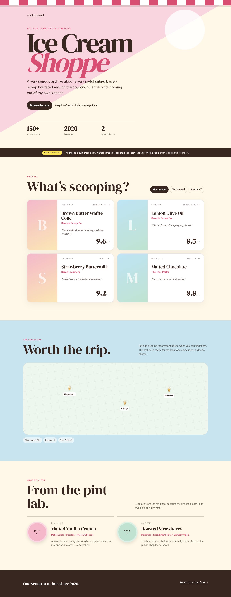
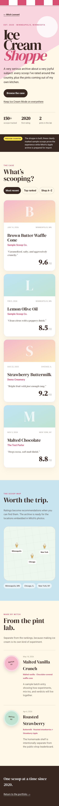

# Ice Cream Shoppe

My ratings, recommendations, and homemade pints—all served from one digital shoppe.

## Quick read

GPT‑5.6 turned a private six-year ice cream archive into a responsive, live collection experience—with persistent Ice Cream Mode, sortable ratings, a map-ready location view, 17 photographed homemade pints, and a validated update workflow.

## Context

Since 2020, I’ve kept a running list of ice cream ratings from around the country and close to home. The ratings lived in Apple Notes, while the photos—and the useful dates and locations attached to them—stayed in a pair of iPhone albums.

## Challenge

Turn a private, loosely structured archive into a public collection without making future updates feel like maintaining a database. The experience also had to feel like a memorable discovery inside my portfolio—not another project link in an increasingly long menu—and location metadata needed a privacy review before publication.

## Execution

- Made Ice Cream Mode a persistent global preference instead of a one-page visual gag. Turning it on changes the site atmosphere and reveals an invitation into the Shoppe across navigation.
- Reconnected the physical side of the original Ice Cream Mode: a full-screen sprinkle field responds continuously to phone orientation, tap bursts add a tactile little payoff, and the browser tab turns into a cone while the mode is on.
- Built an editorial `/ice-cream` experience with a dramatic storefront entrance, sortable rating case, geographic preview, and a distinct Made by Mitch pint lab.
- Kept the collection out of the Projects grid. The existing About and footer references become natural entrances, while the Shoppe remains directly shareable.
- Designed a typed archive schema for public ratings and homemade pints, then populated it from the reviewed private exports.
- Added a spreadsheet-friendly CSV inbox plus validation and import commands, so a new rating can be published without editing application code.
- Browser-tested desktop and mobile behavior, including sorting and cross-route persistence. The test surfaced and fixed an unrelated hydration mismatch caused by random navigation colors.
- Produced a clean Next.js production build with `/ice-cream` statically generated.

## Work

The first working state established the full narrative in one long-form page: storefront, collection case, map, and pint lab.

The same experience condenses into a narrow, touch-friendly layout without turning into an app dashboard.

## GPT‑5.6 experiment — interim read

- **Speed:** kickoff to production-ready first working build in roughly ten minutes of tracked execution time.
- **Autonomy:** translated a broad experience brief into product directions, chose a recommendation, and carried it through architecture, implementation, ingestion design, and verification.
- **Design judgment:** preserved the portfolio’s focus by treating Ice Cream Mode as the entrance rather than adding another main-navigation project item.
- **Implementation quality:** type-check, production build, desktop/mobile browser rendering, sorting, persistence, and console checks passed.
- **Correction required:** the first milestone screenshot appeared before styles had settled and was replaced after inspecting computed CSS. Browser QA also exposed an existing hydration warning, which GPT‑5.6 traced to nondeterministic nav colors and corrected.
- **Real-data migration:** the 155-rating note and its image album aligned chronologically one-to-one; the homemade PDF supplied the exact association between 17 flavors and 27 photos.
- **Privacy correction:** a final JPEG inspection found retained iPhone EXIF/GPS after conversion. GPT‑5.6 adjusted the ingestion script to strip all public image metadata, then regenerated and rechecked the assets.

## Shipped

- The live Shoppe is available at [mitchleonard.com/ice-cream](https://www.mitchleonard.com/ice-cream).
- It contains 155 ratings and 17 Made by Mitch flavors with 27 real photos.
- Future ratings use the CSV inbox and validated importer; the public image pipeline strips metadata before publishing.

## Real archive milestone

The Apple Notes text export and original iPhone Photos album resolved into 155 published ratings. The photo sidecars supplied a capture date for every record and GPS coordinates for 153. Rather than commit raw HEIC originals or their metadata, the build pipeline creates 1200px JPEGs with metadata stripped; the raw import folder stays private and ignored by Git.

The archive’s original-note order and chronological photo order aligned one-to-one. This gives the collection an honest recent-first sort and a geographically informed field without requiring hand-entry of 155 dates.

## Made by Mitch milestone

The homemade album adds 17 pints, from Pumpkin Pie to Cadury Good Time, with 27 images matched to the exact flavor list. The images are intentionally date-only in the collection: capture locations from the personal album are never exposed. The ingestion script now makes that privacy promise enforceable by removing EXIF and GPS from every generated public JPEG.
